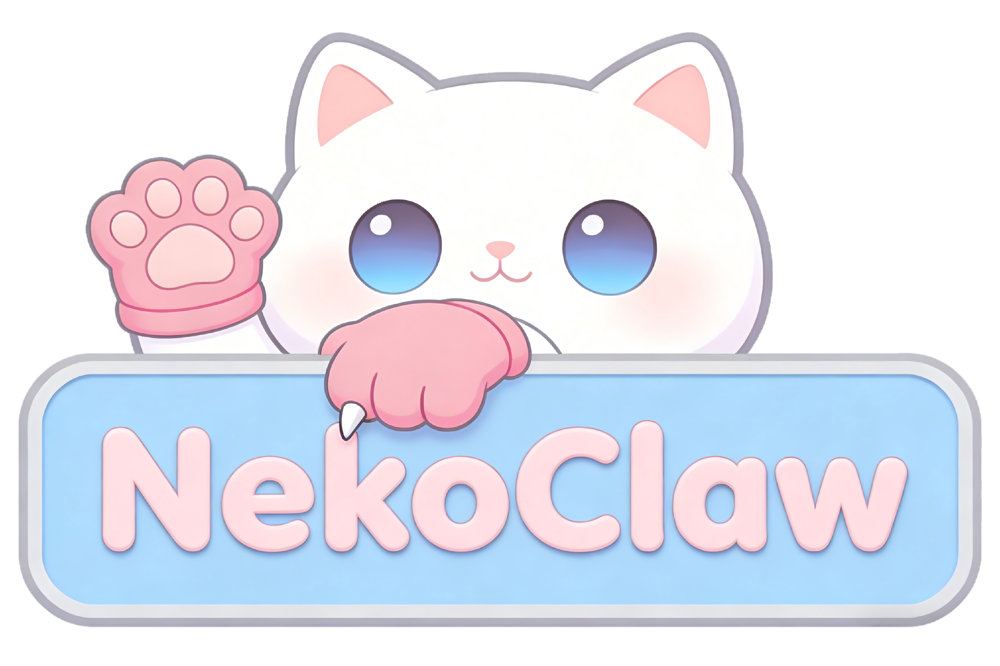

<div align="center">
  

  # NekoClaw

  **你的 AI 伙伴，不只是工具。** 领养一只 AI 猫咪，和它一起工作、一起成长。

  [](LICENSE)
  [](backend/)
  [](desktop/)
  [](backend/)
  [](desktop/)
  [](docker-compose.yml)

</div>

NekoClaw 是一款桌面端 AI 伙伴应用。你的猫咪有自己的记忆、技能和个性，它陪你工作、帮你思考、替你执行，你们一起把事情做好。

## 这是什么

想象你养了一只猫。它很聪明，学会各种本领后能帮你处理大量琐事。你给它一个家，教它新技能，它就会默默地把事情做好。

NekoClaw 就是这个过程的数字版。

- **喵一声** — 随时开启新对话，让猫咪帮你处理任何事情
- **猫脑** — 猫咪的长期记忆，它记住你的偏好、你们的历史
- **猫技** — 教会猫咪新本领，让它掌握更多技能包
- **爪力** — 授权猫咪可以使用哪些工具，精确控制它的能力边界
- **猫钟** — 设置定时任务，让猫咪在特定时间自动执行
- **猫样** — 自定义猫咪的外观、名字和个性
- **猫档** — 服务器连接、LLM 配置等全局设置

## 功能昵称一览

| 你看到的 | NekoClaw 里叫 | 实际上是 |
|---------|--------------|---------|
| 喵一声 | 喵一声 | 新建对话 |
| 猫话录 | 猫话录 | 对话历史列表 |
| 猫脑 | 猫脑 | 记忆库（Markdown 文件 + 笔记） |
| 猫技 | 猫技 | 技能包，教会猫咪完成特定任务的操作指南 |
| 爪力 | 爪力 | 工具权限（联网、代码执行、文件读写等） |
| 猫钟 | 猫钟 | 定时任务调度 |
| 猫样 | 猫样 | 个性化外观与角色设置 |
| 猫主档案 | 猫主档案 | 账户信息、头像、积分 |
| 猫窝设置 | 猫窝设置 | 通用偏好配置 |
| 猫粮站 | 猫粮站 | LLM 模型配置（默认/自定义） |
| MCP | MCP | 服务器连接管理 |
| 猫道 | 猫道 | IM 机器人接入通道 |
| 铃铛 | 铃铛 | 安全与沙箱守卫设置 |
| 猫言猫语 | 猫言猫语 | 帮助与反馈 |

## 部署

```bash
# 克隆仓库
git clone https://github.com/your-org/nekoclaw

# 启动后端服务
docker compose up -d

# 启动桌面客户端（开发模式）
cd desktop
npm install
npm run dev
```

后端默认监听 `localhost:8000`，桌面客户端连接后即可使用。

## License

MIT
