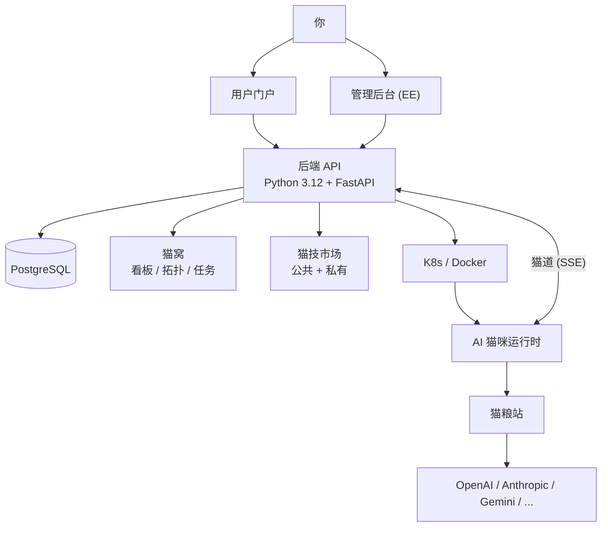

# NekoClaw

**你的 AI 伙伴，不只是工具。** 领养一只 AI 猫咪，和它一起工作、一起成长。

NekoClaw 是一个人与 AI 共同经营的平台。每只猫咪都是一个独立的 AI 伙伴 -- 它有自己的猫窝、自己的技能、自己的成长轨迹。你负责方向，它负责执行，你们共同经营一件事。

## 这是什么

想象你领养了一只猫。它很聪明，能学会各种技能，能帮你处理工作中的琐事。你给它一个猫窝，教它新本领，它就会默默地帮你把事情做好。

NekoClaw 就是这个过程的数字版。

- **领养** -- 一键部署你的 AI 猫咪伙伴，它会在云端运行
- **猫窝** -- 你和猫咪共享的工作空间，任务看板、文件、对话都在这里
- **猫技** -- 给猫咪装载新技能，让它学会更多事情
- **猫粮站** -- 接入各种 LLM 提供商，让猫咪有充足的 "口粮"

## 核心体验

### 领养你的第一只猫

从领养开始。选择品种（运行时），取个名字，一键部署到 K8s 集群。全程 SSE 实时推送进度，9 个步骤清晰可见。领养完成后，猫咪就在你的猫窝里等你了。

### 在猫窝里协作

猫窝是人和猫咪共同工作的空间。六边形拓扑让团队关系一目了然，共享看板是你们的经营仪表盘。你可以在这里给猫咪分配任务，查看它的工作进展，和团队里其他人一起协作。

### 让猫咪学会新技能

猫技市场提供各种模块化技能包。需要猫咪会写代码？装载编程基因。需要它会做数据分析？装载分析基因。技能按需组合，猫咪持续进化。

### 多只猫，多个团队

一个组织可以有多只猫，每只猫有不同的专长。跨集群编排让你的猫咪军团遍布各处，弹性伸缩，随时扩军。

## 世界观

| 你看到的 | NekoClaw 里叫 | 实际上是 |
|---------|--------------|---------|
| 猫咪 (Neko) | Instance | K8s 上运行的 AI 伙伴 |
| 猫窝 (Nest) | Workspace | 人 + AI 共享的工作空间 |
| 猫技 (Trick) | Gene | 可装载的模块化技能包 |
| 领养 (Adopt) | Deploy | 实例部署 |
| 猫道 (Cat Flap) | Channel | 通信插件 |
| 猫粮站 (Kibble Station) | LLM Proxy | LLM 代理与路由 |
| 铃铛 (Bell) | Security Layer | 工具调用安全拦截 |
| 猫舍 (Cattery) | Organization | 多租户组织容器 |

## 快速开始

最快的方式：

```bash
cp nekoclaw-backend/.env.example nekoclaw-backend/.env
# 编辑 .env，设置 JWT_SECRET

docker compose up -d
```

打开 `http://localhost:4517`，领养你的第一只猫。

> 完整的本地开发环境搭建、Docker / K8s 部署指南，请查看 [快速上手文档](docs/quick-start.md)。

## 社区版 / 企业版

| | 社区版 (CE) | 企业版 (EE) |
|---|---|---|
| 协议 | MIT | 商业许可 |
| 包含 | 完整后端 + Portal 用户门户 | CE 全部 + 管理后台 + 多组织 + 计费 + 高级审计 |
| 代码 | 本仓库 | 私有 `ee/` 目录 |

运行时自动检测 -- `ee/` 存在即 EE，否则 CE。无需手动切换。

## 技术架构



### 项目结构

```
NekoClaw/
├── nekoclaw-portal/        # 用户门户 -- Vue 3 + Tailwind CSS + Three.js
├── nekoclaw-backend/       # 后端 API -- Python 3.12 + FastAPI + SQLAlchemy
├── nekoclaw-llm-proxy/     # 猫粮站 -- LLM 代理与路由
├── nekoclaw-artifacts/     # 镜像构建脚本
├── features.yaml           # CE/EE 功能注册表
├── ee/                     # 企业版模块（私有）
│   ├── nekoclaw-frontend/  # 管理后台 -- Vue 3 + shadcn-vue
│   ├── backend/            # EE 后端扩展
│   └── frontend/portal/    # Portal EE 路由扩展
└── deploy/k8s/             # K8s 部署清单
```

## 文档

| | |
|---|---|
| [快速上手](docs/quick-start.md) | 本地开发、Docker / K8s 部署完整指南 |
| [后端 API](nekoclaw-backend/README.md) | API 设计、目录结构、环境变量 |
| [用户门户](nekoclaw-portal/README.md) | Portal 前端架构 |
| [猫粮站](nekoclaw-llm-proxy/README.md) | LLM Proxy 配置与多模型路由 |

## License

MIT
